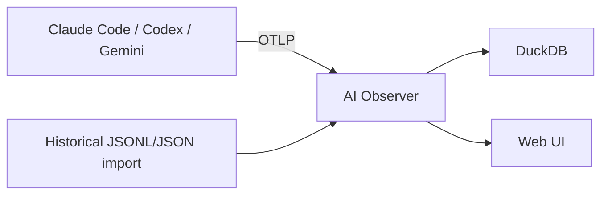
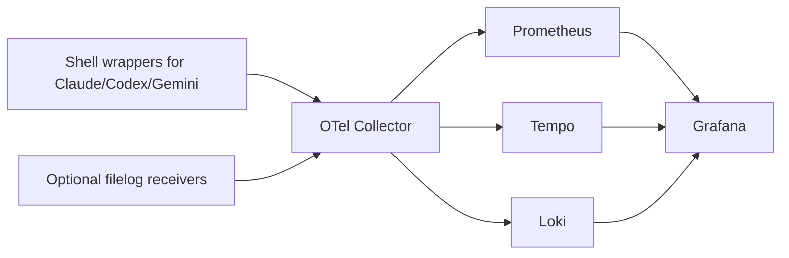
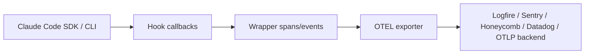
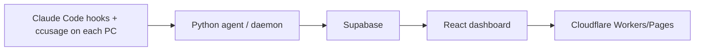
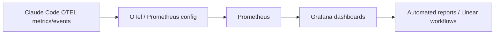
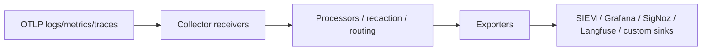
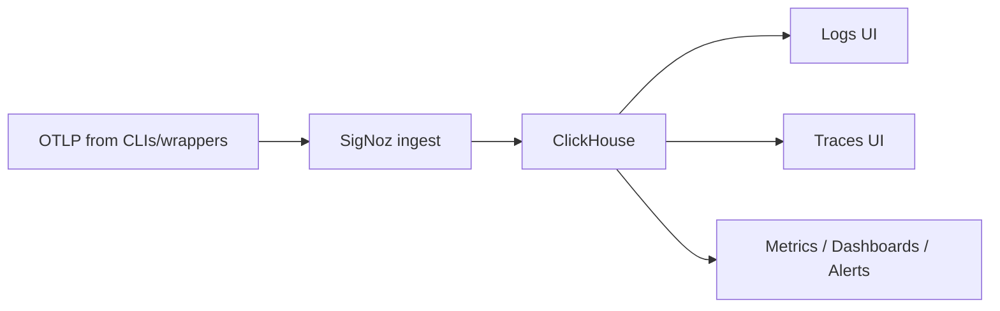
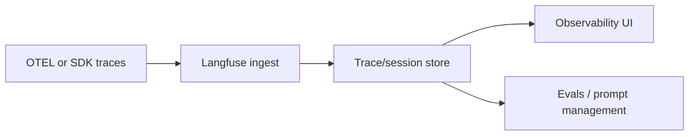

# Open Source and Native Instrumentation for Agent Session Observability

## Executive summary

Yes: there are now credible open-source ways to instrument and observe local agent sessions for **Claude Code**, **Codex**, and, in some cases, **Gemini CLI**. The strongest near-term options are not “plugins” in the narrow browser-extension sense, but a mix of **native hooks and OpenTelemetry exporters**, **thin wrappers around the CLIs/SDKs**, and **collector or dashboard backends**. Among the open-source projects reviewed, the highest-signal options are **AI Observer** for local-first self-hosted observability, **llm-cli-telemetry** for a practical multi-CLI Grafana stack, **claude_telemetry** for a thin Claude-specific wrapper, and **RyanTech00/claude-telemetry** for centralized multi-machine Claude usage tracking. For team backends, **OpenTelemetry Collector Contrib**, **SigNoz**, and **Langfuse** are the most relevant foundation pieces. citeturn22view0turn20view0turn22view1turn23view0turn22view3turn22view4turn22view5

For **Claude Code**, native capabilities are already substantial. Hooks cover a broad lifecycle surface, including `SessionStart`, `UserPromptSubmit`, `PreToolUse`, `PermissionRequest`, `PostToolUse`, `PostToolUseFailure`, `PostToolBatch`, `SubagentStart`, `TaskCreated`, `Stop`, `FileChanged`, `ConfigChange`, `PreCompact`, `Elicitation`, `SessionEnd`, and more. Its OpenTelemetry support can export logs, metrics, and traces; with the right flags enabled, it can emit tool names, file paths, Bash commands, MCP call details, plugin installs, skill activations, and hook execution telemetry. But Claude Code **still does not natively produce package inventories, actual import graphs, or full execution-environment snapshots**. Those must be added via hook scripts, shell wrappers, or OS-level instrumentation. citeturn32view0turn7view0turn4view0turn4view2turn4view3turn5view0turn33view3turn33view4turn33view5

For **Codex**, the native story is meaningfully narrower. Hooks are powerful but cover only six public lifecycle events in the reviewed docs: `SessionStart`, `PreToolUse`, `PermissionRequest`, `PostToolUse`, `UserPromptSubmit`, and `Stop`. Public docs state that `PreToolUse` and `PostToolUse` currently intercept Bash, `apply_patch`, and MCP tools, but **do not fully intercept the newer `unified_exec` shell path**, and **do not intercept `WebSearch` or other non-shell, non-MCP tools**. Codex can export OTel logs, metrics, and traces, but the public docs are much more detailed for **logs and metrics** than for the trace schema; they document representative event names and metric series, but not a Claude-style stable per-span field catalog. That means Codex native telemetry is useful, but not yet sufficient for full-fidelity auditing on its own. citeturn32view1turn10view0turn10view2turn32view2turn14view4turn15view0turn16view0

If the goal is exactly what you described — **which tools/packages were used, which operations executed, and what runtime environment existed** — the most reliable answer today is a **hybrid architecture**: native hooks/OTel for semantic agent events, plus a lightweight snapshot layer for package/env/git state, and, in stricter environments, a process/file-exec layer such as eBPF or auditd for host-truth auditing. That hybrid approach is also the cleanest match to the local-first, instrumentation-oriented workflow implied by your attached overview file, which I treat as project context here: [askdao-cli-overview.md](sandbox:/mnt/data/askdao-cli-overview.md). citeturn22view0turn20view0turn4view0turn32view2

## Open source landscape

The table below compares eight relevant open-source projects. I grouped them into three functional categories: **direct emitters/wrappers**, **reference stacks**, and **backend infrastructure**. The most important distinction is whether a project is capturing **agent semantics** itself, or merely acting as the **destination** for telemetry emitted elsewhere.

| Project | Role | Supported agent CLIs | Data captured | Storage / backends | Deployment complexity | Privacy / security tradeoff | Maturity / activity | Best fit | Sources |
|---|---|---|---|---|---|---|---|---|---|
| **AI Observer** | Self-hosted OTLP-native observability backend with historical import | Claude Code, Codex CLI, Gemini CLI | OTLP metrics/logs/traces; historical session import; model pricing/costs; unified dashboards | Embedded DuckDB + bundled web UI; Docker, Homebrew, binary | Low | Strong local-first posture; data stays local by default, but whatever the CLIs emit still must be redacted upstream | **221 stars**; commits visible on **Mar 29, 2026**; recent release highlighted historical import/export and model pricing | Best local single-binary backend | citeturn22view0turn30view0turn28search6 |
| **llm-cli-telemetry** | Shell-wrapper + OTel collector + Grafana stack for multi-CLI observability | Claude Code, Codex CLI, Gemini CLI | Metrics/logs/traces from native CLIs; optional local log ingestion from `~/.claude/metrics/` and `~/.codex/`; optional prompt/tool-detail logging | OTel Collector + Prometheus + Tempo + Loki + Grafana; optional remote OTLP export | Medium | Good defaults: prompt and tool details off by default; local logs mounted read-only; but enabling local transcript/history ingestion increases sensitivity | **1 star**; **20 commits**; commits visible on **Apr 21, 2026** | Best practical open stack for mixed Claude/Codex/Gemini environments | citeturn20view0turn21view5turn29view0 |
| **claude_telemetry** | Thin observability wrapper around the Claude Code SDK/CLI | Claude Code | Hook-driven telemetry for prompt, tool input/output, token/cost/execution traces; pass-through of normal Claude flags | Any OTEL backend; examples include Logfire, Sentry, Honeycomb, Datadog | Low | Thin and minimally invasive, but still dependent on what hook callbacks can observe; not a host-level audit layer | **23 stars**; commits visible on **Oct 24, 2025** | Best minimal wrapper if you only need Claude Code and want SDK-level pass-through | citeturn22view1turn30view1 |
| **RyanTech00/claude-telemetry** | Multi-machine usage tracker for Claude Code using an agent/daemon model | Claude Code | Usage data via `ccusage`; cost, rate limits, machine/project/model filters; real-time sync at `SessionEnd`/`Stop`; MCP server for querying usage | Python agent per machine + Supabase + React dashboard + Cloudflare Workers/Pages | Medium | Good centralized controls and RLS, but introduces a hosted central DB/API plane unless self-adapted | **10 stars**; commits visible on **Apr 9, 2026**; latest release **Apr 8, 2026** | Best if the goal is centralized Claude usage tracking across several machines, not low-level operation capture | citeturn23view0turn30view2 |
| **Claude Code ROI Measurement Guide** | Official open-source reference stack and guide | Claude Code | Prometheus/Otel/Grafana config; cost, productivity, token, session, team analytics; report generation patterns | Docker Compose + Prometheus + OTel config + Grafana and Linear-oriented reporting patterns | Medium | Useful official baseline; not a turnkey session forensic layer | **308 stars**; **1 commit**; latest visible commit **Jul 29, 2025** | Best as an official reference implementation for teams adopting Claude telemetry | citeturn31view0turn30view3 |
| **OpenTelemetry Collector Contrib** | Vendor-neutral collector and routing layer | Any CLI or wrapper that emits OTLP | Receives logs/metrics/traces; processors for redaction, routing, enrichment; filelog receivers; many exporters | Collector distributions, custom builds, downstream export to SIEM/APM/log stores | Medium | Excellent for policy enforcement and redaction, but provides no end-user dashboard by itself | **4.7k stars**; commits visible on **May 20, 2026** | Best backbone for team or enterprise pipelines | citeturn22view3turn30view4 |
| **SigNoz** | OpenTelemetry-native observability platform | Any OTLP-emitting CLI or wrapper | Logs, traces, metrics, dashboards, alerts; rich correlation and APM-style workflows | SigNoz stack, ClickHouse-backed | Medium | Strong all-in-one backend; privacy depends on self-hosting posture and what raw content you ingest | **27k stars**; commits visible on **May 20, 2026** | Best OSS Datadog-like backend for teams that want one product for logs/traces/metrics | citeturn22view4turn30view5 |
| **Langfuse** | Open-source LLM engineering and observability platform | Any app/CLI bridged via OTEL or SDK | Traces, sessions, debug views, evaluations, prompt management; agent action visibility if instrumented | Self-hosted Langfuse stack; ClickHouse-powered | Medium | Excellent for LLM-debug workflows, but less naturally suited than SigNoz for raw host-level auditing | **27.6k stars**; commits visible on **May 20, 2026** | Best if you want session/trace analysis plus evals and prompt governance | citeturn22view5turn30view6 |

The strongest direct open-source answers to your original question are therefore:

- **AI Observer** if you want the cleanest local-first self-hosted destination for Claude/Codex/Gemini telemetry. citeturn22view0turn30view0
- **llm-cli-telemetry** if you want a concrete wrapper-plus-collector stack that already understands the major coding CLIs and adds optional local log ingestion. citeturn20view0turn21view5turn29view0
- **claude_telemetry** if you want the thinnest way to make Claude Code observable without changing how people invoke it. citeturn22view1turn30view1
- **RyanTech00/claude-telemetry** if your primary problem is “tracking Claude usage across multiple machines,” not full process/file forensics. citeturn23view0turn30view2

Below are concise architecture sketches for each project.

**AI Observer**



AI Observer is the cleanest “collector + storage + UI in one binary” option. It explicitly targets local AI coding tools, supports OTLP ingestion, and can also import historical session files from Claude Code, Codex, and Gemini to backfill costs and history. citeturn22view0turn28search6

**llm-cli-telemetry**



This project is opinionated but practical: it installs shell functions, configures Codex and Gemini telemetry, optionally scrapes local CLI log files, and routes everything into a standard Grafana stack or remote OTLP endpoint. It is the most complete multi-CLI OSS “starter kit” I found. citeturn20view0turn21view5

**claude_telemetry**



`claude_telemetry` is intentionally narrow: it wraps Claude Code, forwards all ordinary flags unchanged, and inserts observability callbacks at `UserPromptSubmit`, `PreToolUse`, `PostToolUse`, and session completion. That makes it ideal for a thin Claude-only integration, but not for cross-CLI fleet standardization. citeturn22view1turn30view1

**RyanTech00/claude-telemetry**



This project is better understood as a **centralized accounting and fleet usage** system than as low-level agent execution instrumentation. It leans on existing Claude usage parsers rather than raw hook/OTel event semantics, which is why it is attractive for cost and rate-limit visibility but weaker for per-command forensic fidelity. citeturn23view0turn30view2

**Claude Code ROI Measurement Guide**



This official Anthropic repository is not a generic observability product, but it is a valuable reference for how Anthropic itself expects teams to operationalize Claude Code telemetry for cost, productivity, and ROI reporting. citeturn31view0turn30view3

**OpenTelemetry Collector Contrib**



The Collector Contrib repo is the right backbone when you need protocol conversion, redaction, fan-out, filelog ingestion, and a central control point. It is infrastructure, not the final analyst experience. citeturn22view3turn30view4

**SigNoz**



SigNoz is the most complete open-source “one console” backend in this set for logs, traces, metrics, and alerts. It is especially attractive when the organization wants OTLP-native observability but does not want to stitch together Prometheus, Loki, Tempo, and Grafana itself. citeturn22view4turn30view5

**Langfuse**



Langfuse is not CLI-session-specific, but it becomes relevant when your goal is to **inspect agent traces as LLM traces**, attach feedback or evals, and manage prompts centrally. It is less suited than SigNoz for raw file/process auditing, but stronger for LLM engineering workflows. citeturn22view5turn30view6

## Native hooks and OpenTelemetry in Claude Code and Codex

The single most important finding from the official docs is that **Claude Code has the richer native hook surface**, while **Codex has the narrower but still useful one**.

For **Claude Code**, the documented hook lifecycle includes session, prompt, tool, permission, subagent, task, configuration, compaction, worktree, and MCP elicitation events. The official event table lists `SessionStart`, `Setup`, `UserPromptSubmit`, `UserPromptExpansion`, `PreToolUse`, `PermissionRequest`, `PermissionDenied`, `PostToolUse`, `PostToolUseFailure`, `PostToolBatch`, `Notification`, `SubagentStart`, `SubagentStop`, `TaskCreated`, `TaskCompleted`, `Stop`, `StopFailure`, `TeammateIdle`, `InstructionsLoaded`, `ConfigChange`, `CwdChanged`, `FileChanged`, `WorktreeCreate`, `WorktreeRemove`, `PreCompact`, `PostCompact`, `Elicitation`, `ElicitationResult`, and `SessionEnd`. Common hook input fields include `session_id`, `transcript_path`, `cwd`, `permission_mode`, `effort.level`, and `hook_event_name`, with `agent_id` and `agent_type` present in subagent contexts. Event-specific payloads then layer in fields such as `tool_name`, `tool_input`, `tool_use_id`, `tool_response`, `last_assistant_message`, `task_id`, `reason`, and more. citeturn32view0turn7view0turn2view5turn2view7turn2view8turn6view4

For **Codex**, the reviewed public hook docs expose a much smaller set: `SessionStart`, `PreToolUse`, `PermissionRequest`, `PostToolUse`, `UserPromptSubmit`, and `Stop`. Common inputs are `session_id`, `transcript_path`, `cwd`, `hook_event_name`, and a Codex-specific `model`; turn-scoped hooks add `turn_id`, and event-specific tables provide `tool_name`, `tool_use_id`, `tool_input`, `tool_response`, `prompt`, `stop_hook_active`, and `last_assistant_message`. One explicit warning matters a great deal for build-quality observability: Codex says `transcript_path` exists for convenience, but the **transcript format is not a stable interface** for hooks and may change. citeturn32view1turn8view7turn10view0turn10view2

The second major difference is **how broad the tool interception actually is**.

Claude’s hook model can sit around virtually every documented tool-use step in the agentic loop, and its monitoring page also exposes structured OpenTelemetry events for prompt submission, tool results, tool decisions, auth, MCP server activity, plugin installs/loads, skill activation, hook registration/execution, compaction, and feedback survey events. At the trace layer, Claude documents a stable span hierarchy — `claude_code.interaction`, `claude_code.llm_request`, `claude_code.tool`, `claude_code.tool.blocked_on_user`, `claude_code.tool.execution`, and an optional `claude_code.hook` span for detailed beta tracing — together with documented attributes such as `tool_name`, `duration_ms`, `result_tokens`, and, when enabled, `file_path`, `full_command`, `skill_name`, and `tool_input`. citeturn4view0turn4view2turn4view3turn33view3turn33view4turn5view0

Codex is more constrained. The docs say `PreToolUse` and `PostToolUse` can intercept **Bash**, **`apply_patch`**, and **MCP tool calls**, but they explicitly warn that this does **not intercept all shell calls yet**, because the newer `unified_exec` mechanism is not fully covered, and that these hooks also do **not intercept `WebSearch` or other non-shell, non-MCP tool calls**. That is the clearest official gap in the Codex hook model for the kind of “whole-session operation capture” you want. citeturn9view1turn10view0turn10view1turn10view2

On the **OpenTelemetry** side, Claude Code is better documented and more controllable. Important flags and behaviors include:

- `OTEL_LOG_USER_PROMPTS=1` to log raw user prompts.
- `OTEL_LOG_TOOL_DETAILS=1` to include tool parameters and arguments such as file paths, Bash commands, MCP tool names, skill names, and hook matchers.
- `OTEL_LOG_TOOL_CONTENT=1` to include tool input/output content in traces, truncated to 60 KB.
- `OTEL_LOG_RAW_API_BODIES` to emit full Anthropic request/response bodies, including conversation history.
- `TRACEPARENT` propagation into Bash and PowerShell subprocesses when tracing is enabled, which is particularly useful for correlating external shell instrumentation with native Claude spans. citeturn3view1turn3view2turn3view0turn5view0

Claude’s limitations are mostly about **privacy defaults and completeness of environment capture**, not about the existence of structured telemetry. Prompt content, tool details, tool content, and raw API bodies are all **off by default** or gated; detailed hook spans require beta tracing settings, and in interactive sessions may require allowlisting. There is also no built-in “package inventory at this point in the session” object or “environment snapshot” event. You can see the tool arguments and some system resource attributes like `os.type`, `os.version`, `host.arch`, `service.version`, and `session.id`, but not a full `pip freeze` or `npm ls` equivalent unless you add it yourself. citeturn4view3turn4view7turn5view0turn33view5

Codex’s OTel story is usable but thinner. The official docs show an `[otel]` block with `exporter`, `trace_exporter`, `metrics_exporter`, and `log_user_prompt`, and say that event metadata includes service name, CLI version, env tag, conversation id, model, and sandbox/approval settings. Representative event names include `codex.conversation_starts`, `codex.api_request`, `codex.sse_event`, `codex.websocket_request`, `codex.websocket_event`, `codex.user_prompt`, `codex.tool_decision`, and `codex.tool_result`; metrics include `codex.api_request`, `codex.sse_event`, `codex.websocket.request`, `codex.websocket.event`, and `codex.tool.call` counters and durations. The docs also note that metrics collection sent back to OpenAI is separate from OTel export and can be disabled with `[analytics].enabled = false`. citeturn32view2turn11view4turn14view0turn14view4turn15view0

The practical Codex gaps are threefold. First, the public docs do not document a stable trace field catalog comparable to Claude’s span schema. Second, hooks do not comprehensively cover all tool paths. Third, an OpenAI GitHub issue opened on February 26, 2026 documented that the interactive CLI respected `[otel]`, but `codex exec` lacked metrics and `codex mcp-server` lacked telemetry entirely; the issue page available here is closed, but does not expose the fixing release on the rendered page, so I would treat that issue as evidence that these surfaces have recently had observability gaps and should be tested explicitly in your environment before you rely on them. citeturn16view0turn32view2

The short answer to “can native capabilities alone meet the goal?” is therefore:

- **Claude Code native hooks + OTel** can get you very close for **tool calls**, **Bash commands**, **file paths/touched files**, **permission decisions**, **MCP activity**, **plugin/skill/hook lifecycle**, and **prompt/tool correlation**. They are **not enough** by themselves for package inventories, actual runtime imports, or full environment snapshots. citeturn32view0turn4view2turn5view0turn33view3turn33view4
- **Codex native hooks + OTel** are useful for **supported tool paths** and for session/request/tool-result telemetry, but they are **not enough** for whole-session auditing, because coverage is narrower and the documented telemetry surface is less complete. citeturn32view1turn10view0turn32view2

## Capturing packages and runtime dependencies

This is the part that native agent telemetry does **not** solve well.

The cleanest low-friction method is **hook-based snapshots**. In Claude Code, the broad hook surface means you can run a `SessionStart` hook that records whitelisted environment variables, `uname`/OS info, active Python/Node/Go/Rust toolchain versions, and a package snapshot such as `pip freeze`, `poetry export`, `npm ls --json --depth=0`, `pnpm list --json`, `go list -m all`, or `cargo metadata`. A `Stop` or `SessionEnd` hook can then record the closing snapshot and diff it against the starting state. Claude’s hook payload already gives you `session_id`, `cwd`, `transcript_path`, `permission_mode`, and often the surrounding tool context, which makes these snapshots easy to correlate. Codex can do similar things with `SessionStart`, `PreToolUse`, `PostToolUse`, and `Stop`, but because its hook coverage is narrower and project-local OTEL config is restricted to user-level config, the operational surface is a little more awkward. citeturn7view0turn32view0turn32view1turn13view0

The advantage of hook snapshots is that they are **simple, portable, and privacy-manageable**. The drawback is that they measure **what is installed or visible**, not **what was actually imported or executed**. A `pip freeze` result tells you the environment contains `numpy`; it does not tell you whether the Bash command or Python script that Claude launched actually imported it. That makes hook snapshots ideal for **environment provenance**, but only approximate for **runtime dependency truth**. This is the reason I recommend them as the baseline, not the final answer. citeturn32view0turn32view1

A second layer is **shell wrapping**. Projects like `llm-cli-telemetry` already demonstrate the pattern: shell functions can inject `OTEL_RESOURCE_ATTRIBUTES`, toggle prompt/tool detail logging, and ensure that Codex or Gemini get pointed to the correct exporter. You can extend that same wrapper pattern to run a cheap environment capture before or after each top-level invocation, hash the relevant files, or capture `git rev-parse HEAD`, `git branch --show-current`, and the package-manager lockfile digests. This is often the highest-leverage compromise for small teams because it works without kernel tooling and can standardize multi-CLI provenance. The downside is that wrappers are easier to bypass, and they only see the launches that go through the wrapper. citeturn20view0turn32view2

For **actual runtime dependency use**, the highest-fidelity approach is an **OS-level observation layer** such as **eBPF**, **auditd**, or, for debugging only, **strace**. I am treating this as architectural judgment rather than a claim about a specific reviewed project, but in practice the trade-off is consistent: this layer is the only one that can tell you what the process tree really executed (`execve`), what files it really opened (`openat`), and, if scoped carefully, whether it touched `site-packages`, `node_modules`, shared libraries, lockfiles, or shell binaries during a session. That can reveal actual dynamic imports and transitive dependencies in a way that `pip freeze` never will. The price is higher complexity, Linux-centric implementation, and much greater privacy sensitivity, because this layer can easily over-collect file paths, secrets, and unrelated host activity if it is not scoped to a container, cgroup, or agent process tree. No reviewed OSS project here gives you this end to end; this is an add-on pattern you would build around the agent CLIs. 

A fourth pattern is **container/runtime capture**. If you run Claude Code or Codex inside a devcontainer, Docker container, Nix shell, or similarly pinned runtime, you get a very strong **environment snapshot** almost for free: image digest, SBOM, mounted directories, declared package set, and often an isolated network/filesystem boundary. This is excellent for reproducibility and compliance. It is weaker for “which package was actually imported during this session?” unless paired with hook or kernel data, but it is arguably the easiest way to make environment provenance deterministic.

My recommendation by use case is straightforward:

- Use **hook snapshots** when you want low-friction visibility into environment state and package inventory.
- Add **shell wrappers** when you need cross-CLI standardization and user identity/resource-attribute injection.
- Add **containerization** when reproducibility and isolation matter.
- Add **eBPF/auditd** only when you truly need host-truth auditing or compliance-grade operation logging.

## Recommended implementation patterns

### Quickstart pattern

This is the fastest path that already solves most of the original problem for an individual developer or a very small team.

Use **AI Observer** or **llm-cli-telemetry** as the destination, enable native Claude or Codex OTel export, and add one small hook package that emits environment/package snapshots at session boundaries. AI Observer is the easiest local-first target; `llm-cli-telemetry` is the easiest cross-CLI starter stack if Claude, Codex, and Gemini all matter. citeturn22view0turn20view0

The components are:

1. **Backend**  
   Run AI Observer locally, or run the `llm-cli-telemetry` Docker stack. AI Observer exposes OTLP on port `4318` and stores data in DuckDB; `llm-cli-telemetry` stands up Collector + Prometheus + Tempo + Loki + Grafana. citeturn22view0turn20view0

2. **Claude Code native telemetry**  
   Enable `CLAUDE_CODE_ENABLE_TELEMETRY=1`, point logs and optionally traces at OTLP, and set `OTEL_LOG_TOOL_DETAILS=1` only if you need file paths and command strings. Leave `OTEL_LOG_TOOL_CONTENT=0` unless you have a clear reason to capture raw file contents or Bash output. citeturn5view0turn3view1turn3view0

3. **Codex native telemetry**  
   Set `[otel].exporter`, and if you want traces, `[otel].trace_exporter`, in user-level `~/.codex/config.toml`. If you use `llm-cli-telemetry`, let its setup script install the `[otel]` block and wrapper functions. Remember that project-local `.codex/config.toml` cannot override `otel`. citeturn20view0turn13view0turn15view0

4. **Hook scripts for snapshots**  
   Add `SessionStart` and `SessionEnd`/`Stop` hooks that collect:
   - whitelisted env vars such as `PATH`, `HOME`, `VIRTUAL_ENV`, `CONDA_PREFIX`, `NPM_CONFIG_PREFIX`
   - `python --version`, `node --version`, `go version`, `rustc --version`
   - `pip freeze`, `npm ls --json --depth=0`, and equivalently for the ecosystems you care about
   - `git rev-parse HEAD`, branch, dirty state, remote URL hash  
   In Claude Code, this is especially natural because the native hook surface is richer. citeturn32view0turn7view0

5. **Effort estimate**  
   Roughly **half a day to one day** if you can stay close to the existing project defaults.

This pattern meets the goals for **tool calls**, **Bash/file operations**, **session-level package inventory**, and **basic execution environment capture**, but not for exact process-tree truth or dynamic import tracing.

### Team-grade Grafana pattern

This is the best default for a growing engineering team that wants operational dashboards, search, retention controls, and a collector policy layer.

Use **OpenTelemetry Collector Contrib** as the central policy and ingest layer, then route to either **Grafana stack components** or **SigNoz**. If you want maximum flexibility and already know the Grafana ecosystem, use Collector + Prometheus + Loki + Tempo + Grafana. If you want a more integrated experience, use SigNoz as the backend. Claude Code’s official ROI guide is a solid baseline for how to wire Claude metrics into a Prometheus-oriented operational workflow. citeturn22view3turn22view4turn31view0

The components are:

1. **Collector as the choke point**  
   Ingest OTLP from Claude Code, Codex, wrappers such as `claude_telemetry`, and optional filelog receivers for local structured files. Use processor stages for attribute redaction, log-to-metric conversion, resource enrichment, and routing. citeturn22view3turn20view0

2. **Native emitters first, wrappers second**  
   Prefer native Claude and Codex telemetry where available, because they know semantic event names like `claude_code.tool_result` and `codex.tool_result`. Use wrappers only for the missing pieces: user identity injection, package snapshots, lockfile hashes, or standardization across other tools such as Gemini. citeturn33view3turn32view2turn20view0

3. **Retention tiers**  
   A sensible default is:
   - traces: **7–14 days**
   - structured tool and prompt metadata: **30 days**
   - package/env snapshots and git metadata: **30–90 days**
   - aggregate metrics: **90–365 days**  
   This is an implementation recommendation, not an official vendor prescription.

4. **Security controls**  
   Apply allowlist-based env capture and drop rules in the Collector. For Codex subprocesses, combine this with `shell_environment_policy` so the agent itself does not inherit broad secret surfaces in the first place. citeturn32view2

5. **Effort estimate**  
   Roughly **two to five days**, depending on whether SigNoz is used as the single backend or you build a full Grafana stack.

This pattern is the best balance of **team usability**, **searchability**, **alerting**, and **reasonable privacy governance**.

### Full-fidelity auditing pattern

This is for regulated or security-sensitive environments where “what actually executed” matters more than developer convenience.

The core idea is to treat native agent telemetry as the **semantic layer** and to pair it with a **runtime-truth layer**. Run the agent inside a container or dedicated devbox/worktree, emit native OTLP from Claude/Codex, add session-start/stop snapshot hooks, and scope an OS-level sensor to the agent process tree or cgroup to capture `execve`, file opens, and network connections. Native event IDs such as Claude `session.id` and Codex `session_id`/`turn_id` then become the join keys for enriching low-level events. Claude’s `TRACEPARENT` inheritance into Bash/PowerShell subprocesses is especially valuable here, because it provides a built-in correlation bridge between Claude’s semantic span tree and downstream shell instrumentation. citeturn5view0turn32view0turn32view1

The components are:

1. **Isolation boundary**  
   Run the agent in a container/devcontainer or tightly scoped workstation service account.

2. **Semantic instrumentation**  
   Enable Claude or Codex native OTLP. For Codex, test each entry point you plan to rely on — especially `codex exec` or `codex mcp-server` — before declaring coverage complete. citeturn16view0turn32view2

3. **Snapshot layer**  
   Session hooks emit environment, package, and git snapshots.

4. **Runtime-truth layer**  
   OS-level process/file/network observation, tightly scoped to the agent runtime, records what actually executed.

5. **Archive and review backend**  
   Use Collector + SIEM/APM backend, or a split: SigNoz for operational telemetry, object storage/warehouse for long-term audit material.

6. **Effort estimate**  
   Roughly **one to three weeks**, because most of the complexity is in safely scoping and governing the low-level audit layer.

This is the only pattern here that can credibly answer both “what did the agent intend to do?” and “what actually happened on the host?”

### Recommended internal event schema

The following normalized schema is a good compromise between official native fields and the extra fields you will need for auditing. The field names intentionally align where possible with official surfaces such as Claude `session.id`, `tool_name`, `tool_use_id`, and Codex `session_id` / `turn_id`. citeturn7view0turn8view7turn10view0turn33view5

```json
{
  "$schema": "https://json-schema.org/draft/2020-12/schema",
  "title": "Agent Session Event",
  "type": "object",
  "required": ["timestamp", "event_type", "session"],
  "properties": {
    "timestamp": { "type": "string", "format": "date-time" },
    "event_type": {
      "type": "string",
      "enum": [
        "user_prompt",
        "tool_call",
        "tool_result",
        "tool_decision",
        "env_snapshot",
        "package_snapshot",
        "git_snapshot",
        "exec_event",
        "file_event"
      ]
    },
    "session": {
      "type": "object",
      "required": ["id", "agent_cli"],
      "properties": {
        "id": { "type": "string" },
        "agent_cli": {
          "type": "string",
          "enum": ["claude-code", "codex", "gemini-cli", "other"]
        },
        "turn_id": { "type": ["string", "null"] },
        "prompt_id": { "type": ["string", "null"] },
        "cwd": { "type": ["string", "null"] },
        "transcript_path": { "type": ["string", "null"] },
        "permission_mode": { "type": ["string", "null"] },
        "model": { "type": ["string", "null"] }
      }
    },
    "tool": {
      "type": ["object", "null"],
      "properties": {
        "name": { "type": ["string", "null"] },
        "use_id": { "type": ["string", "null"] },
        "input": { "type": ["object", "string", "null"] },
        "output_ref": { "type": ["string", "null"] },
        "success": { "type": ["boolean", "null"] },
        "duration_ms": { "type": ["number", "null"] }
      }
    },
    "environment": {
      "type": ["object", "null"],
      "properties": {
        "os_type": { "type": ["string", "null"] },
        "os_version": { "type": ["string", "null"] },
        "host_arch": { "type": ["string", "null"] },
        "vars": { "type": "object", "additionalProperties": { "type": "string" } },
        "var_allowlist": { "type": "array", "items": { "type": "string" } }
      }
    },
    "git": {
      "type": ["object", "null"],
      "properties": {
        "repo_root": { "type": ["string", "null"] },
        "branch": { "type": ["string", "null"] },
        "commit": { "type": ["string", "null"] },
        "dirty": { "type": ["boolean", "null"] },
        "remote_hash": { "type": ["string", "null"] }
      }
    },
    "packages": {
      "type": ["array", "null"],
      "items": {
        "type": "object",
        "properties": {
          "ecosystem": { "type": "string" },
          "name": { "type": "string" },
          "version": { "type": "string" },
          "source": { "type": ["string", "null"] }
        }
      }
    },
    "provenance": {
      "type": "object",
      "properties": {
        "native_source": { "type": ["string", "null"] },
        "collector": { "type": ["string", "null"] },
        "host_sensor": { "type": ["string", "null"] }
      }
    }
  }
}
```

## Security and privacy considerations

The biggest risk is not whether these tools can capture enough, but whether they capture **too much**.

For Claude Code, prompt text, tool arguments, tool content, and raw API bodies are all gated. `OTEL_LOG_USER_PROMPTS`, `OTEL_LOG_TOOL_DETAILS`, `OTEL_LOG_TOOL_CONTENT`, and `OTEL_LOG_RAW_API_BODIES` progressively increase sensitivity, with the raw API-body mode explicitly including the **full conversation history** while still redacting Claude’s extended-thinking content. Anthropic also notes that OAuth-authenticated sessions can include `user.email` in telemetry attributes. In other words: Claude’s defaults are relatively privacy-preserving, but the moment you turn on detail/content/body modes, you must assume you are exporting potentially sensitive source code, shell output, secrets embedded in arguments, and personally identifying data unless you actively redact them downstream. citeturn3view1turn3view2turn5view0turn33view5

For Codex, `otel.log_user_prompt` is off by default, and the docs explicitly provide `shell_environment_policy` to constrain which environment variables reach subprocesses. That policy should be treated as a **first barrier**, not the whole solution: it reduces secret exposure inside the agent runtime, while the collector or backend should enforce a second barrier for logs, traces, and snapshots. The official docs also note that project-local config cannot set `otel`, which is useful operationally because it prevents repositories from silently redirecting telemetry destinations. citeturn15view0turn32view2turn13view0

Open-source wrapper stacks can widen the exposure surface. `llm-cli-telemetry` is careful here: prompt and tool-detail logging are off by default, and its optional local file ingestion mounts local CLI data read-only; it also states that `auth.json` is not read by the collector. Still, once you choose to ingest Claude metrics/history files or Codex session/history files, you are turning local developer transcript material into centralized observability data. That is fine for many teams, but only if the team makes that consent boundary explicit. citeturn21view5

The mitigations I would strongly recommend are:

1. **Default to metadata-only collection.**  
   Enable event/trace correlation, tool names, durations, and status first. Turn on prompt/tool content only per project, team, or temporary debug window. Claude’s flags make this easy; Codex similarly keeps prompt content off by default. citeturn3view1turn3view2turn32view2

2. **Use allowlists, not blocklists, for environment capture.**  
   Only emit a small explicit set such as `PATH`, `HOME`, `VIRTUAL_ENV`, toolchain roots, and workspace identifiers. Never dump the whole process environment.

3. **Hash remotes, don’t export them raw.**  
   Git remote URLs frequently embed enterprise topology or usernames.

4. **Separate hot and cold retention.**  
   Keep searchable operational metadata for longer than raw prompt/code content.

5. **Scope low-level auditing tightly.**  
   If you add eBPF/auditd-style observation, confine it to the agent container/cgroup or process family. Do not run a whole-host unrestricted file-open or exec audit unless you truly need workstation-wide compliance logging.

6. **Use RBAC and mTLS between collectors and backends.**  
   This matters more than most teams realize, because the observability pipeline itself becomes an aggregation point for sensitive engineering data.

### Open questions and limitations

Two limitations remain important.

First, the **current** state of Codex telemetry outside the interactive CLI is not fully proven by the reviewed public docs alone. The February 2026 GitHub issue documenting gaps in `codex exec` and `codex mcp-server` was closed, but the rendered issue page available here does not reveal the exact fixing release. If those entry points matter to you, test them directly in your environment before betting an audit pipeline on them. citeturn16view0

Second, none of the reviewed open-source projects provides a cross-platform, turn-key answer to **“which packages were actually imported at runtime by every child process spawned during the session?”**. That remains a hybrid problem: native agent semantics plus optional host-level instrumentation. The open-source ecosystem is already good at the first half; it is still fragmented on the second half.