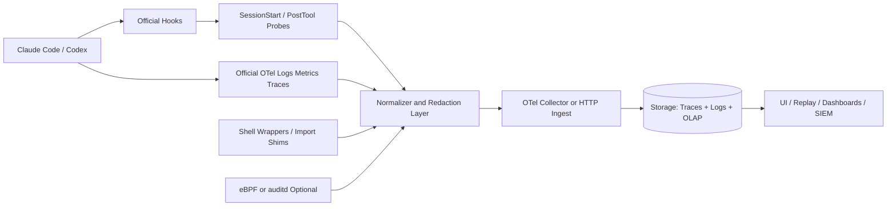

# 面向 Claude Code 与 Codex 的 Agent Session 审计与观测研究报告

## 执行摘要

你的判断基本是对的：**如果目标是重建一个具体任务场景下 Agent 实际“用到了什么、做了什么、处在什么运行环境中”，纯本地静态扫描很难做到准确；以 hook/OTel 为中心、在 Agent 执行路径上做行为观测，才是更可靠的主线。** 这和你上传的项目概述与工程评估文档所强调的方向是一致的。fileciteturn0file0 fileciteturn0file1

更具体地说，**Claude Code 官方能力已经足够覆盖“会话边界 + prompt 关联 + tool 调用 + token/cost + permission 决策 + cwd/transcript + 部分子代理事件”这一层的审计需求**；Codex 官方能力也已经覆盖了 hooks、OTel logs/metrics/traces 和插件化打包，但它在 hook 可拦截面上比 Claude Code 更窄，尤其是 shell 路径覆盖仍不完整。两者都**不能**原生告诉你“某个 Bash 进程内部到底 import 了哪些 Python/Node/Rust 包”“某个 shell 命令又偷偷拉起了哪些子进程”“运行时动态下载了哪些依赖”。这些仍然需要**post-tool probe、shell wrapper、语言级 shim，或者 eBPF/auditd 之类的系统层补充采集**。citeturn15view2turn15view3turn15view4turn19view0turn22view5turn23view0turn24view0turn26view1

从开源项目角度看，**最值得优先研究的不是“某一个万能插件”，而是几种能力的组合**。如果你要做产品级 PoC，最优先推荐的是：**用 Claude Code / Codex 官方 hooks 与 OTel 做原生采集，用 AI Observer 做本地统一后端与可视化，再借鉴 agent-trace、claude-tap、claude_telemetry 等项目在 replay、策略控制、proxy 级抓取和 headless 观测上的实现思路。** AI Observer 最像可以直接拿来当“统一观测底座”的项目；agent-trace 最像“行为回放/规则控制”的参考实现；claude-tap 最像“API 面精确抓包”的研究工具；claude_telemetry 与 pydantic 的 Logfire 插件最适合借鉴 Claude Code 的 hook/trace 打包方式。citeturn5view4turn7view2turn7view3turn11view0turn11view1turn10view2turn13view7turn5view6turn5view7

结论可以压缩成一句话：**“hook-based 观测”应该成为你的主采集面；“本地环境扫描”只适合作为 SessionStart 的基线快照；如果你要真正回答依赖与运行时来源问题，必须再补一层进程级或语言级 runtime instrumentation。** citeturn15view0turn15view6turn19view0turn23view0turn24view0

## 开源项目盘点与比较

下表聚焦与你问题最相关、且值得真正研究的开源项目。表中的“环境快照”一列，指项目是否**原生**提供接近“运行环境 / 依赖视图”的能力；大多数项目在这项上都只是部分支持或需要你二次开发。

| 项目 | 许可 | 支持 CLI | 核心能力 | 部署形态 | 成熟度判断 | 主要局限 | 推荐场景 |
|---|---|---|---|---|---|---|---|
| **AI Observer** citeturn5view4turn7view0turn8view0 | MIT | Claude Code / Codex CLI / Gemini CLI | 会话活动、token/cost、API latency、错误率、历史 JSON/JSONL 导入、Parquet 导出、OTLP 原生、自带 DuckDB + Dashboard | 单二进制或 Docker | **高**：功能面完整，已有多个 release，作为后端最成熟 | 自己不是 hook 插件；不原生抓 import/hidden subprocess/env diff | **最适合作为统一本地观测后端** |
| **llm-cli-telemetry** citeturn5view5turn6view3turn8view1 | MIT | Claude Code / Codex CLI / Gemini CLI | OpenTelemetry Collector + Prometheus/Loki/Tempo/Grafana；可选读取 Claude 本地 metrics/history/tool_debug/context 与 Codex sessions/history/Git metadata | Shell wrapper + Collector + LGTM Stack | **中低**：思路完整，但公开版本和社区信号都很早期 | 更像参考工程；运维面比 AI Observer 重；环境观察仍主要依赖本地日志与配置 | **快速搭多 CLI 观测样板间** |
| **claude_telemetry** citeturn5view6turn6view7turn6view9turn8view2 | MIT | Claude Code | 作为 `claudia` 包装器替代 `claude`；记录 tool call、inputs/outputs、token、cost、timing；兼容 Logfire/Datadog/Honeycomb/Grafana | CLI wrapper / Python package | **中**：小而清晰，适合借鉴 | Claude-only；依赖 wrapper 路径；不是通用后端 | **Claude headless / CI 场景快速观察** |
| **pydantic/claude-code-logfire-plugin** citeturn5view7 | MIT | Claude Code | 官方 marketplace 安装方式；每个 session 变成 trace，子 span 为 LLM 调用；支持本地 JSONL event log 和分布式 tracing | Claude Code 插件 | **中**：实现很“正统”，但目标产品单一 | Logfire 导向；不做跨 CLI；不是全面 runtime 审计 | **学习 Claude Code 插件化打包与 trace 映射** |
| **claude-session-logger** citeturn5view8turn8view3 | GPL-3.0 | Claude Code | hook-based 会话日志、命令历史、task 日志、transcript symlink | 本地 hook 扩展 | **中**：轻量、直接、近期仍在迭代 | Claude-only；无 OTLP；更像本地文本日志层 | **最简本地日志参考实现** |
| **agent-trace** citeturn11view0turn11view1turn11view2turn11view5 | MIT | Claude Code / Cursor / Gemini CLI / 任意 MCP client | “strace for AI agents”；捕获并回放 tool/prompt/response；HTML viewer；OTLP export；规则中断；drift detection | CLI 工具 + hook / MCP proxy / Python decorator | **中高**：功能野心大、release 频繁 | 对 Codex 不是官方一等公民；更偏 replay / rule engine；环境快照仍需你补 | **回放、审计、行为漂移分析** |
| **claude-tap** citeturn10view2turn13view4turn13view7turn13view8 | MIT | Claude Code / Codex CLI / Gemini CLI / OpenCode / Kimi / Pi / Hermes / Cursor CLI / Qoder | 本地 proxy + trace viewer；可见 system prompts、conversation history、tool schemas、tool calls、streaming responses、token usage、request diffs；输出 JSONL + HTML | 本地 proxy / trace viewer | **高**：支持面广，release 频繁 | **只在 API 面**；看不到本地进程内部 import / 子进程；敏感数据风险高 | **实验室级精确抓包、上下文 diff 调试** |
| **codex-sync-plugin** citeturn5view9turn8view4 | MIT | Codex CLI | 把 Codex session 同步到 OpenSync；跟踪 session、tool usage、token consumption；自动写入 notify hook | Codex 插件 / 外部 Dashboard | **中低**：功能聚焦但面窄；尚无 releases | 外部服务依赖；不强调 env/runtime；不是 OTLP-first | **团队可视化与云同步** |

如果把“值得重点研究”的优先级再压缩一层，我会建议你这样排序：

**第一层：AI Observer、官方 hooks/OTel、agent-trace。**  
AI Observer 解决“统一 ingest + 存储 + 查询 + UI”；官方 hooks/OTel 解决“稳定采集面”；agent-trace 提供“行为 replay / rule enforcement / OTLP export”方面的优秀参考。citeturn7view2turn7view3turn19view0turn11view0turn11view1

**第二层：claude-tap、claude_telemetry、pydantic Logfire 插件。**  
这一层更适合借鉴具体技术：claude-tap 借鉴 API 面精确抓取；claude_telemetry 借鉴 headless wrapper；Logfire 插件借鉴 Claude Code 官方插件的打包、状态持久化与 trace 映射。citeturn10view2turn13view7turn5view6turn5view7turn17view3

**第三层：claude-session-logger、codex-sync-plugin。**  
它们不是“统一底座”，但很适合作为最小实现或某个垂直场景的参考代码。citeturn5view8turn5view9

还有两个项目值得提，但我**不建议把它们作为主线依赖**：

其一是 **disler/claude-code-hooks-multi-agent-observability**。它的架构很有参考价值：`Claude Agents → Hook Scripts → HTTP POST → Bun Server → SQLite → WebSocket → Vue Client`，而且目标就是“实时观察多 agent hook 事件”。但该仓库页面未给出明确开源许可证，同时仓库里现在还有 “Add Open Source License” 的公开 issue；此外也存在 hook 解析错误会阻断 Bash 的 issue。更适合当“思路参考”，不适合直接纳入产品主依赖。citeturn10view0turn13view2turn14view0

其二是 **claude-trace**。它能“看见 Claude 隐藏的东西”，包括 system prompt、tool outputs、raw API data，并生成本地 JSONL/HTML 报告；但它的实现方式是把 interceptor 注入到 Claude Code、拦截 `fetch()` 调用，这类方案天然脆弱，仓库 issue 里已经出现了 Claude Code 切到“native binary”安装后失效的问题。它很适合做研究或逆向观察，不适合做稳定底座。citeturn12view0turn12view3turn12view4turn9search10

## Claude Code 与 Codex 的官方能力边界

### Claude Code 官方 hooks 与 OTel 到底能看到什么

Claude Code 的 hooks 是非常完整的“生命周期切点”系统：它支持 **command hooks、HTTP hooks、LLM prompt hooks**，会在会话生命周期不同阶段把 JSON 上下文传给你的处理器。公共字段包括 `session_id`、`transcript_path`、`cwd`、`permission_mode`、`effort`、`hook_event_name`。Hook 事件覆盖了 `SessionStart`、`UserPromptSubmit`、`PreToolUse`、`PostToolUse`、`PostToolUseFailure`、`PostToolBatch`、`SubagentStart/Stop`、`TaskCreated/Completed`、`Stop/StopFailure`、`TeammateIdle`、`FileChanged`、`CwdChanged`、`PreCompact/PostCompact`、`SessionEnd` 等。citeturn15view5turn17view0turn16view3turn17view4

对你的问题最关键的是几个事件。`SessionStart` 会给出 `source`、`model`，必要时还有 `agent_type`；并且 Claude Code 会把 `CLAUDE_ENV_FILE` 暴露给 `SessionStart`、`Setup`、`CwdChanged`、`FileChanged` hooks，让你把环境变量持久化给后续 Bash 命令。官方文档甚至给了“前后比较 exported vars 差异”的示例，这意味着你可以在会话开始时建立**环境基线**，而不是只做脱离上下文的本地扫描。`PreToolUse` 会暴露 `tool_name`、`tool_input`、`tool_use_id`；`PostToolUse` 会再给 `tool_response`；`PostToolUseFailure` 还包含 `error`、`is_interrupt` 和 `duration_ms`。这已经足够可靠地重建大部分“工具层面的行为时间线”。citeturn15view0turn15view2turn15view3turn15view4turn15view6

Claude Code 的 OTel 侧也不弱。官方文档明确说明它可以导出 **metrics、events/logs，以及可选的 distributed traces**。指标层面有 session count、active time、token usage、cost、代码改动、PR、commit 等；事件层面有 `claude_code.user_prompt`、`tool_result`、`api_request`、`api_error`、`api_request_body`、`api_response_body`、`tool_decision`、`permission_mode_changed`、`mcp_server_connection`、hook execution start/complete、plugin metrics、compaction 等。`tool_result` 事件有 `tool_name`、`tool_use_id`、`success`、`duration_ms`、输入/结果大小，并且在 `OTEL_LOG_TOOL_DETAILS=1` 时还能附带 `tool_parameters` 与 `tool_input`。citeturn19view0turn20view0turn20view1turn20view2turn21view0turn21view1turn20view8turn20view9

在 traces 方面，Claude Code 还更进一步。官方 span 层级是 `claude_code.interaction -> llm_request / hook / tool`，其中 tool span 下面还有 `blocked_on_user` 与 `tool.execution` 子 span。开启 tracing 后，**Bash 与 PowerShell 子进程会自动继承 `TRACEPARENT`**，这样如果子进程本身也支持 OTel，就能把自己的 spans 挂到 Claude Code 的 tool execution span 下面。这个能力对于“补齐 Bash 工具内部的细节”很重要。citeturn22view4turn22view5turn22view1turn22view3

但 Claude Code 原生能力也有清晰边界。官方文档明确写了：默认情况下**不会**记录 prompt 内容、tool 参数和 tool content；raw file contents 与 code snippets 也**不在 metrics/events 里**，只有在 tracing 并显式打开 `OTEL_LOG_TOOL_CONTENT=1`、`OTEL_LOG_RAW_API_BODIES` 等开关时才进入单独的路径。更重要的是，官方只把可见性定义到“prompt / tool / API / hook / subprocess trace context”这一层，并没有任何进程内 module/import 级别的语义。因此，**从官方公开能力推断，Claude Code 原生可以很好地审计“工具边界”，但不能原生审计“工具内部进程究竟 import 了什么包、又拉起了什么隐藏子进程”。** 这不是文档里显式说“不支持”，而是从它暴露的字段边界得出的工程结论。citeturn19view1turn22view2turn22view5turn22view6

### Codex 官方 hooks、plugins 与 OTel 到底能看到什么

Codex 现在也已经有足够“正式”的 hooks 体系，而且 hooks 默认是开启的。它会从 `hooks.json` 或 `config.toml` 里的内联 `[hooks]` 读取配置；**已安装的插件也可以通过 manifest 或默认的 `hooks/hooks.json` 打包生命周期配置**。这意味着在 Codex 里，你完全可以把“审计/观测逻辑”作为一个插件或用户级配置来交付，而不是手工要求每个仓库都复制脚本。citeturn5view2turn23view7turn28view2

Codex hook 的公共字段包括 `session_id`、`transcript_path`、`cwd`、`hook_event_name`、`model`；turn 作用域事件还有 `turn_id` 这个 Codex 扩展字段。`SessionStart`、`PreToolUse`、`PermissionRequest`、`PostToolUse`、`UserPromptSubmit`、`Stop` 这些事件还会带上 `permission_mode`。其中 `SessionStart` 能按 `source` 匹配 `startup` / `resume` / `clear`；`PreToolUse` 会给你 `tool_name`、`tool_use_id`、`tool_input`；`PermissionRequest` 可以 allow/deny 审批请求；`PostToolUse` 会给你 `tool_response`；`UserPromptSubmit` 和 `Stop` 则支持 common output fields。官方还明确说过：`transcript_path` 只是“为了方便”，**其 transcript 格式不是稳定接口**。这点很重要，因为它意味着你不能把 transcript 文件结构当作长期稳定 schema。citeturn23view0turn23view1turn23view2turn23view3turn23view4turn23view5turn23view10

对你最重要的，是 Codex 官方文档已经把 hook 的“可拦截边界”说得很直白：`PreToolUse` 目前主要拦截 **Bash、通过 `apply_patch` 的文件编辑、以及 MCP tool calls**；但这仍然不是完整 enforcement boundary，因为 Codex 可能通过其他支持的工具路径完成等价工作。官方还特别指出：**它目前并不拦截所有 shell 调用，`unified_exec` 路径的 interception 仍不完整；它也不拦截 `WebSearch` 或其他非 shell、非 MCP 工具。** 这直接回答了“能不能只靠 Codex 官方 hooks 解决我遇到的问题”：**不能完全解决，尤其不能把它当作完整的 runtime 审计边界。** citeturn23view0

不过，Codex 也有两个非常实用的优势。第一，`PreToolUse` 现在已经支持 `updatedInput` 改写，这意味着你不只是能记录或 deny，还能在支持的路径上**rewrite command / MCP args**。第二，配置参考已经明确列出 `otel.exporter`、`otel.metrics_exporter` 与 `otel.trace_exporter`，说明 Codex 在官方层面已经支持 **logs + metrics + traces** 的分路导出，而不是只有日志。citeturn23view11turn26view1

Codex 的 OTel 文档也相当关键。官方说明 `[otel]` 可导出 `codex.conversation_starts`、`api_request`、`sse_event`、`websocket_request`、`websocket_event`、`user_prompt`、`tool_decision`、`tool_result` 等结构化事件；指标上则有 `codex.tool.call`、`codex.tool.call.duration_ms` 等 runtime 与 tool activity metrics。与此同时，官方又明确说：如果 metric 带有 `tool` 字段，它表示的是**内部工具类型**，例如 `apply_patch` 或 `shell`，**而不是实际 shell command**。这意味着：**只靠 Codex 的 metrics，你无法知道真正执行了什么命令；需要 hooks 才能拿到 `tool_input.command`，而且只限已拦截到的 Bash / apply_patch / MCP 路径。** citeturn24view0turn24view4turn24view6

还有几个边界也很重要。其一，Codex 的 project-local `.codex/config.toml` **不能覆盖 `otel` 路由配置**，所以如果你想做组织级或开发机级采集，必须走 user-level config。其二，官方文档明确说 **只有 `type: "command"` 的 hook handler 今天会执行；`prompt` 与 `agent` handler 虽然会被解析，但会被跳过；`async` 也只是“解析但不支持”。** 这意味着你如果设计插件或 hook，要优先按 command handler 的交付思路来做。citeturn26view3turn23view10

## Hook 观察与本地环境扫描的可行性判断

### 为什么纯扫描很难得到“真实依赖”

本地环境扫描能回答的问题，更多是“机器上装了什么”，而不是“这次任务真正用到了什么”。你可以扫描出 `pip list`、`npm ls`、`cargo metadata`、`go env`、系统 PATH、shell profile、容器 base image、甚至本机上所有解释器版本，但这些数据和一次具体 agent session 的**实际执行路径**之间，差了至少三层：

第一层是**上下文层**。某个包即使安装在环境里，也未必被这次任务真正 import 或调用；反过来，任务里也可能在运行时下载了新依赖、切换了虚拟环境、source 了额外的 shell 初始化脚本，或者通过 MCP/远端服务把真正工作放到了别处。官方 hooks/OTel 文档之所以重要，就在于它们至少能把你拉回“这次 prompt 引发了哪些具体 tool / API / permission 流程”的上下文。citeturn15view0turn17view0turn19view0turn23view0turn24view0

第二层是**执行层**。真正影响结果的，常常不是“安装了哪些包”，而是“Bash 实际执行了什么命令、命令产生了什么输出、是否写文件、是否触发了新的子进程”。Claude Code 在这层观测上已经很强，Codex 在 support tool 路径上也能做到相当程度，但两者都还是围绕 tool boundary；它们并不等于 `strace`、`auditd` 或语言运行时 profiler。citeturn15view3turn15view4turn20view1turn22view1turn23view1turn24view6

第三层是**运行时内部层**。如果一个 Bash 命令是 `python script.py`，官方 hooks 能看到 “执行了这个 Bash tool，命令字符串是什么，花了多久，是否成功”；但它并不能原生告诉你 `script.py` 在进程内 import 了哪些模块、是否动态 `pip install`、是否 `subprocess.Popen()` 了别的命令。Claude Code 的 `TRACEPARENT` 继承可以帮助你把**愿意发 OTel 的子进程**串进同一 trace，但它不会自动把“非 OTel 子进程的内部事件”变成可见对象。Codex 官方文档连这层 trace context 继承都没有公开说明得像 Claude 那样详细。citeturn22view5turn22view6turn24view0turn26view1

### 可行性结论与补救路径

因此，**hook-based 方案对“动作观测”是强可行，对“环境重建”是中等可行，对“依赖真实使用集重建”是部分可行。**

如果你把目标拆成三件事，就会更清楚：

| 目标 | 本地扫描 | 官方 hooks / OTel | 结论 |
|---|---|---|---|
| 记录 session 里发生了什么动作 | 弱 | 强 | **应以 hooks/OTel 为主** |
| 记录会话开始时置身于什么环境 | 中 | 中强 | **SessionStart 快照优于离线全盘扫描** |
| 记录“真实使用过的依赖 / import / 隐藏子进程” | 弱 | 弱到中 | **必须补 runtime instrumentation** |

这个表不是在说扫描没价值，而是在说它的位置应该后移。更合理的做法是：

在 **SessionStart** 做一次“**最小必要环境快照**”：`uname -a`、OS/arch、当前 repo、git branch/commit、解释器路径与版本、有效 PATH、当前 package manager lockfile 摘要、`.python-version` / `.nvmrc` / `go.mod` / `Cargo.lock` 是否存在、关键 env vars 的 allowlist 视图、容器/WSL 标识。Claude Code 的 `SessionStart` + `CLAUDE_ENV_FILE` 天然适合做这件事；Codex 则适合在 `SessionStart` hook 里直接跑 probes 并把结果写到你自己的 side log。citeturn15view0turn15view6turn23view2turn23view10

在 **PreToolUse / PostToolUse** 做“**动作周围的差分探针**”：针对 Bash、apply_patch、MCP 工具等高价值路径，记录命令、输入参数、输出摘要、返回码、文件触达摘要、前后运行时版本差异。Claude Code 原生会给你 `tool_input` / `tool_response` / `tool_use_id`；Codex 对 Bash / apply_patch / MCP 也能给到这些，但覆盖不完整，所以需要把“哪些 tool path 被漏掉”作为预期内风险来建模。citeturn15view2turn15view3turn20view1turn23view0turn23view1

在 **Shell / 进程层** 再补一层：这是最关键的建议。  
如果你真的要回答“用了哪些包”，那单靠 hooks 仍然不够。你需要至少选择以下一种补充：

- **shell wrapper**：把 `python`、`node`、`npm`、`pip`、`cargo`、`go`、`uv`、`poetry` 等常见入口换成可记录 `execve + argv + cwd + env allowlist` 的轻量封装；
- **语言级 shim**：例如 Python 的 `sitecustomize` / import hook、Node 的 loader/require hook，用于记录 import / module load；
- **eBPF / auditd / execsnoop**：记录进程创建、文件打开、网络连接，作为“ground truth”；
- **OTel-aware subprocess**：利用 Claude Code 的 `TRACEPARENT` 继承，把你可控的脚本、测试器、build runner 发到同一 trace。citeturn22view5turn24view0

从安全与隐私角度看，官方能力已经给了你一个很好的默认策略：**默认只采结构化元数据，不采原文内容；只有在 incident/debug 模式下才打开 prompt / tool / raw API body。** Claude Code 明确把 `OTEL_LOG_USER_PROMPTS`、`OTEL_LOG_TOOL_DETAILS`、`OTEL_LOG_TOOL_CONTENT`、`OTEL_LOG_RAW_API_BODIES` 做成显式 opt-in；Codex 也默认把 `log_user_prompt = false`，并把 OTel 导出设为 disabled-by-default。你自己的系统设计，最好沿用这一原则。citeturn19view1turn22view2turn24view3turn24view4

## 推荐的采集架构与数据模型

### 推荐的最小可用架构

你的最佳起点不是“做一个全能扫描器”，而是做一个**四层观测面**：

- **控制面**：Claude Code / Codex 官方 hooks + OTel  
- **环境面**：SessionStart 与 PostToolUse probes  
- **运行时面**：shell wrapper / 语言级 shim  
- **系统面**：可选的 eBPF / auditd / execsnoop

下面这个数据流适合做第一版 PoC：



这个结构有两个优点。第一，它把**官方稳定接口**放在最前面，降低你被上游变更打断的风险。第二，它让“重型采集”成为可选增强，而不是默认负担。Claude Code 与 Codex 都已经能提供稳定的 session/tool/decision/prompt 关联；你只需要把 runtime gap 补到你真正关心的程度，而不是从 day one 就做全机扫描。citeturn19view0turn22view3turn23view7turn24view0turn26view3

### 建议的数据模型与保留策略

建议你的数据模型至少包含六类实体：`session`、`interaction/turn`、`tool_call`、`process_exec`、`env_snapshot`、`dependency_observation`。其中前面三类尽量对齐官方 schema；后面三类由你新增。Claude Code 的 `session_id`、`transcript_path`、`cwd`、`tool_use_id`、`prompt.id`、`duration_ms`，以及 Codex 的 `turn_id`、`tool_input`、`tool_response`，都很适合作为主键和关联键。citeturn17view0turn20view1turn20view0turn23view0turn23view1turn23view10

一个适合第一版的 session / event schema，可以像这样：

```json
{
  "session": {
    "session_id": "sess_abc123",
    "agent_cli": "claude-code",
    "model": "claude-sonnet-4-6",
    "source": "startup",
    "cwd": "/workspace/my-repo",
    "transcript_path": "/Users/me/.claude/projects/.../abc.jsonl",
    "permission_mode": "default",
    "user_id": "hashed-user",
    "resource_attrs": {
      "service.name": "askdao-agent-audit",
      "deployment.environment": "dev"
    },
    "git": {
      "repo_root": "/workspace/my-repo",
      "branch": "feature/x",
      "commit": "abcde12345",
      "dirty": true
    },
    "env_snapshot_ref": "sha256:...",
    "started_at": "2026-05-21T10:00:00Z",
    "ended_at": "2026-05-21T10:12:34Z"
  },
  "event": {
    "event_id": "evt_001",
    "session_id": "sess_abc123",
    "turn_id": "turn_17",
    "prompt_id": "prompt_uuid_if_available",
    "hook_event_name": "PostToolUse",
    "event_name": "tool_result",
    "tool_name": "Bash",
    "tool_use_id": "toolu_01...",
    "tool_input": {
      "command": "pytest -q"
    },
    "tool_response": {
      "success": true,
      "exit_code": 0,
      "stdout_ref": "blob://..."
    },
    "success": true,
    "duration_ms": 4187,
    "decision_source": "hook",
    "trace_id": "otel-trace-id",
    "span_id": "otel-span-id",
    "redaction_level": "structural"
  },
  "process_exec": {
    "parent_tool_use_id": "toolu_01...",
    "pid": 23145,
    "ppid": 23112,
    "argv": ["python", "-m", "pytest", "-q"],
    "cwd": "/workspace/my-repo",
    "env_allowlist": {
      "PATH": "...",
      "VIRTUAL_ENV": "...",
      "PYTHONPATH": "..."
    }
  },
  "dependency_observation": {
    "parent_tool_use_id": "toolu_01...",
    "language": "python",
    "kind": "import",
    "name": "pytest",
    "version": "8.3.2",
    "source": "runtime-shim"
  }
}
```

保留策略上，我建议采用**冷热分层**。结构化 metadata（session、tool、decision、duration、counts）可以留 **30 到 90 天**；prompt/tool content 这类高敏感正文留 **3 到 7 天**；raw API body 或 HTML full replay 只在调试期开启，并尽量落到独立存储。这样既符合官方默认 redaction 思路，也更接近实际安全审计习惯。Claude Code 官方文档甚至明确提醒：`tool_input`、`tool content`、`raw API bodies` 都可能包含敏感数据；Codex 也强调 prompt 默认应 redacted。citeturn22view2turn19view1turn24view3

红线建议也很明确：  
**不要**默认长期保存完整 prompt、完整 tool output、完整 raw API request/response。  
**要**默认保存：tool 名称、时长、成功/失败、cwd、repo、transcript ref、tool_use_id、prompt.id、模型、permission source。  
**可按需打开**：Bash command 明文、Read 工具正文、MCP 参数体、API body。citeturn20view1turn20view2turn22view2turn24view0

## 优先级建议与原型计划

### 我建议你先 prototype 哪些项目

如果你的目标是验证“hook-based 观察是否足够替代扫描成为主路径”，我建议按下面顺序做：

**第一优先：官方 hooks/OTel + AI Observer。**  
这是最稳的组合。它直接回答你的核心问题：不先做复杂扫描，只先记录 session、prompt、tool、decision、cost、cwd、transcript、子代理事件，看能不能先把“行为画像”立起来。AI Observer 能吃 OTLP，也能导入历史 Claude/Codex/Gemini 本地会话文件，适合做统一后端。citeturn19view0turn23view7turn7view2turn7view3

**第二优先：agent-trace。**  
不是因为它能取代官方 hooks，而是因为它在“回放、注释、规则中断、drift detection、OTLP export”这几块已经给出了非常具体的产品原型。你不一定要直接采用它，但非常值得研究它的 event model 和 replay UX。citeturn11view0turn11view1turn11view2

**第三优先：claude-tap。**  
如果你想研究“到底哪些信息在 API 面可见、哪些只能从本地执行面补”，claude-tap 是最有效的对照工具之一。它能很直观地告诉你：system prompt、历史消息、tool schema、tool calls、streaming responses 和 request diff 确实都能在 proxy 面看到；但本地 import / hidden subprocess 仍然看不到。这个对做产品边界定义很有帮助。citeturn10view2turn13view7turn13view8

**第四优先：claude_telemetry 与 pydantic Logfire 插件。**  
这一层主要是借鉴“如何把 Claude Code hooks 打成可安装组件”的工程手法，而不是当作最终底座。citeturn5view6turn5view7turn17view3

### 最小 PoC 的建议步骤

先把**统一后端**跑起来。AI Observer 的官方 quick start 非常直接：可以单 Docker 跑在本地，暴露 dashboard 与 OTLP ingest 端口。citeturn7view2

然后给 Claude Code 打开原生 telemetry，并补一层最小 hooks。官方环境变量最小集合大致如下：

```bash
export CLAUDE_CODE_ENABLE_TELEMETRY=1
export OTEL_METRICS_EXPORTER=otlp
export OTEL_LOGS_EXPORTER=otlp
export OTEL_EXPORTER_OTLP_PROTOCOL=http/protobuf
export OTEL_EXPORTER_OTLP_ENDPOINT=http://localhost:4318
```

接着，把 `SessionStart`、`PreToolUse`、`PostToolUse`、`PostToolUseFailure`、`SessionEnd` 接到你自己的 logger/probe 上。对 Claude Code 来说，`SessionStart` 最适合采环境基线，`PostToolUse` 最适合做 Bash 后探针。citeturn19view0turn15view0turn15view2turn15view3turn15view4

Codex 侧则建议同时打开 OTel 与 hooks。最小 user-level 配置可以写成：

```toml
[otel]
environment = "dev"
log_user_prompt = false
exporter = { otlp-http = { endpoint = "http://localhost:4318/v1/logs", protocol = "binary" } }
trace_exporter = { otlp-http = { endpoint = "http://localhost:4318/v1/traces", protocol = "binary" } }

[[hooks.SessionStart]]
matcher = "startup|resume"
[[hooks.SessionStart.hooks]]
type = "command"
command = "python3 ~/.codex/hooks/session_start.py"

[[hooks.PreToolUse]]
matcher = "^Bash$|^apply_patch$"
[[hooks.PreToolUse.hooks]]
type = "command"
command = "python3 ~/.codex/hooks/pre_tool_use.py"

[[hooks.PostToolUse]]
matcher = "^Bash$|^apply_patch$"
[[hooks.PostToolUse.hooks]]
type = "command"
command = "python3 ~/.codex/hooks/post_tool_use.py"
```

这里有两个注意点。第一，`otel` 必须放在 user-level config，因为 project-local `.codex/config.toml` 会忽略 telemetry routing keys。第二，Codex 的 `PreToolUse` 覆盖并不完整，所以 PoC 的预期不要设成“100% 捕获所有运行时动作”。citeturn24view0turn26view1turn26view3turn23view0

### 时间与资源估算

如果只做“证明 hook-based 路线成立”的 PoC，我认为**一个工程师一周内**可以拿到非常像样的结果：

| 阶段 | 目标 | 估算 |
|---|---|---|
| **基础接线** | Claude Code / Codex 原生 OTel + hooks 接入统一后端；验证 session/tool/prompt/cost 可见 | **1 到 2 天** |
| **环境基线** | SessionStart probes、PostToolUse Bash probes、env snapshot 与 git/runtime 信息入库 | **1 到 2 天** |
| **runtime 增强** | shell wrapper 或一门语言的 import shim（Python 优先） | **2 到 3 天** |
| **评估与回放** | 做一版 session replay / 差异分析视图，验证“能否回答实际问题” | **1 到 2 天** |

如果团队资源有限，我会建议**先别上 eBPF**。先用官方 hooks/OTel + env probes + shell wrapper 证明价值，再决定是否需要系统级观测。因为一旦你上了 eBPF/auditd，采集量、隐私与部署复杂度都会显著上升。这个顺序会更符合产品收敛逻辑。citeturn19view0turn22view5turn24view0

## 开放问题与限制

本次结论里，最高置信的部分是：**官方 hooks/OTel 已经足够做 session/tool/prompt/decision/cost 级别审计；但对 import graph、隐藏子进程、动态依赖下载的可见性仍然不足。** 这一点在 Claude Code 与 Codex 两边都成立，只是 Codex 的 hook 覆盖面更窄。citeturn23view0turn24view6turn22view6

还有几个现实限制需要明确写出来：

- **Codex 的 transcript_path 不是稳定接口**，因此不要把 transcript 文件 schema 当作长期契约。citeturn23view1
- **Codex 的 hooks 当前只有 command handler 真正执行**；`prompt`/`agent`/`async` 相关能力还不能当成可交付基础。citeturn23view10
- **Claude Code 的详细 tracing 仍有 beta 面**，且更细粒度的 hook span 需要额外 detailed beta tracing 条件。citeturn22view1turn22view4
- **proxy 型方案** 如 claude-tap / claude-trace 很适合研究，但不等于生产级 runtime ground truth。它们记录的是 API 面，不是本地执行面。citeturn10view2turn12view0

综合来看，我的最终建议是：

**把你的产品路线定义为“官方 hooks/OTel 驱动的行为观测底座 + SessionStart/PostTool 环境探针 + 可选 runtime instrumentation”，而不是“从本地环境扫描推出 agent 运行环境”。**  
这条路线与当前 Claude Code / Codex 的官方能力是对齐的，也更容易在工程上做出可验证、可收敛、可升级的系统。citeturn15view6turn19view0turn23view0turn24view0